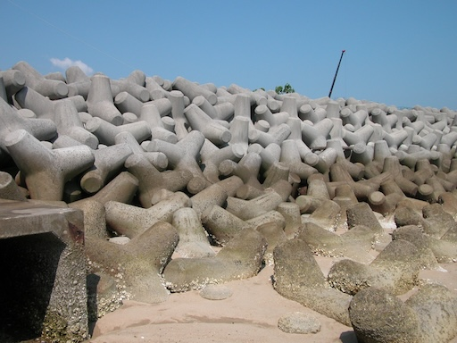
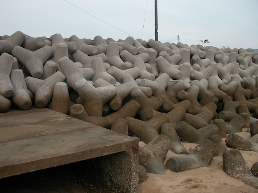
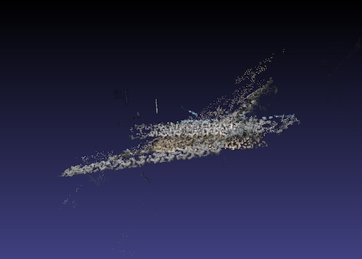

# Scale Matching of 3D Point Clouds by Finding Keyscales with Spin Images

There is the 3D point cloud data used in the following [ICPR2010 paper](https://ieeexplore.ieee.org/document/5597540).

- [data/aut.ply](data/aug.ply)
- [data/oct.ply](data/oct.ply)





## reference

Please refere the following [ICPR2010 paper](https://ieeexplore.ieee.org/document/5597540) when you use the data.

```bibtex
@INPROCEEDINGS{5597540,
  author={Tamaki, Toru and Tanigawa, Shunsuke and Ueno, Yuji and Raytchev, Bisser and Kaneda, Kazufumi},
  booktitle={2010 20th International Conference on Pattern Recognition},
  title={Scale Matching of 3D Point Clouds by Finding Keyscales with Spin Images},
  year={2010},
  pages={3480-3483},
  doi={10.1109/ICPR.2010.850}
  }
```
